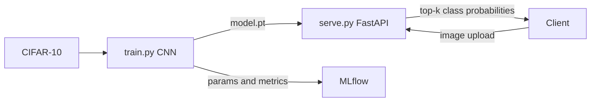

# Image Classifier


CIFAR-10 image classification using a custom CNN built with PyTorch. Trained with data augmentation, batch normalization, and cosine annealing. Experiment tracking with MLflow, served via FastAPI.

## Classes

airplane, automobile, bird, cat, deer, dog, frog, horse, ship, truck

## Architecture



## Tech Stack

| Layer | Technology |
|---|---|
| Language | Python 3.11 |
| Model | Custom CNN (PyTorch) |
| Dataset | CIFAR-10 |
| Experiment Tracking | MLflow |
| API | FastAPI + Uvicorn |
| Containerization | Docker |
| CI/CD | GitHub Actions |
| Testing | Pytest |

## Quick Start

**Install dependencies**

```bash
pip install -r requirements.txt
```

**Train the model**

CIFAR-10 downloads automatically on first run (~170MB).

```bash
python src/train.py
python src/train.py --epochs 50 --lr 0.001 --batch-size 128
mlflow ui
```

**Serve the API**

```bash
uvicorn src.serve:app --reload
```

**Run with Docker**

```bash
docker build -t image-classifier .
docker run -p 8000:8000 -v $(pwd)/data:/app/data image-classifier
```

## API Endpoints

| Method | Endpoint | Description |
|---|---|---|
| GET | `/health` | Readiness probe |
| GET | `/classes` | List all 10 classes |
| POST | `/predict` | Classify an image |

**Example request:**

```bash
curl -X POST http://localhost:8000/predict \
  -F "file=@your_image.jpg"
```

Response shape only. The values below show the JSON structure, they are not a
measured prediction. See [Results](#results).

```json
{
  "prediction": "automobile",
  "confidence": 0.8721,
  "confident": true,
  "top_k": [
    {"class": "automobile", "probability": 0.8721},
    {"class": "truck", "probability": 0.0943},
    {"class": "ship", "probability": 0.0211}
  ]
}
```

Uploads are capped at 10 MB (`413` above that) and batches at 20 files
(`422` above that).

## Results

No trained checkpoint is published yet. `data/model.pt` is gitignored and the
test suite writes a randomly initialised one so the API can boot, so there is
no accuracy number here and none is claimed elsewhere in this README.

Training is reproducible. The seed is a CLI argument, logged to MLflow and
stored inside the checkpoint, and cuDNN runs deterministically by default:

```bash
python src/train.py --seed 42
```

Checkpoints are saved as a bundle of weights, hyperparameters, seed and final
metrics, mirrored to `data/metrics.json`. Numbers go here once the model is
trained on a GPU.

## Model Architecture

Three convolutional blocks, each with two Conv2D layers, batch normalization, ReLU activation, max pooling, and dropout. Followed by a two-layer classifier head.

```
Input (3x32x32)
    ConvBlock(3 -> 32)   -> 32x16x16
    ConvBlock(32 -> 64)  -> 64x8x8
    ConvBlock(64 -> 128) -> 128x4x4
    FC(2048 -> 512) -> ReLU -> Dropout
    FC(512 -> 10)
```

## Running Tests

```bash
pytest tests/ -v
```

## CI/CD

Every push to `main` runs the test suite, then builds the Docker image and publishes it to GitHub Container Registry.

## License

Released under the MIT License. See [LICENSE](LICENSE).
